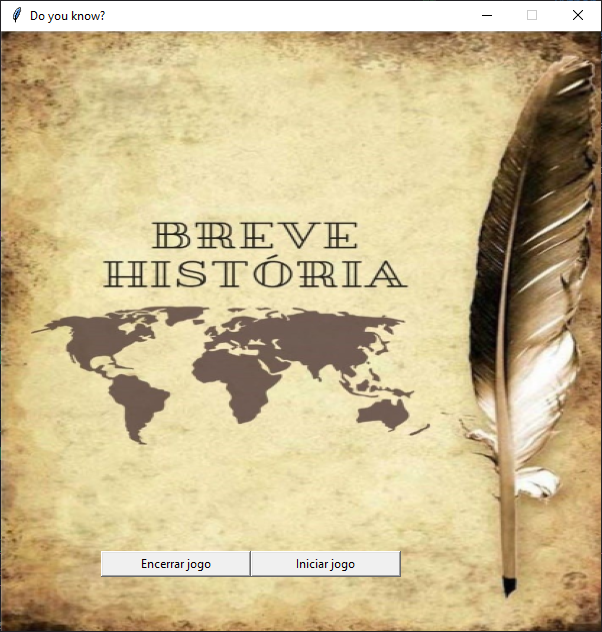
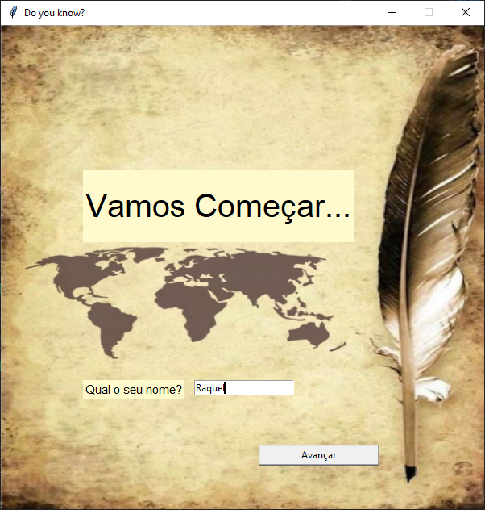
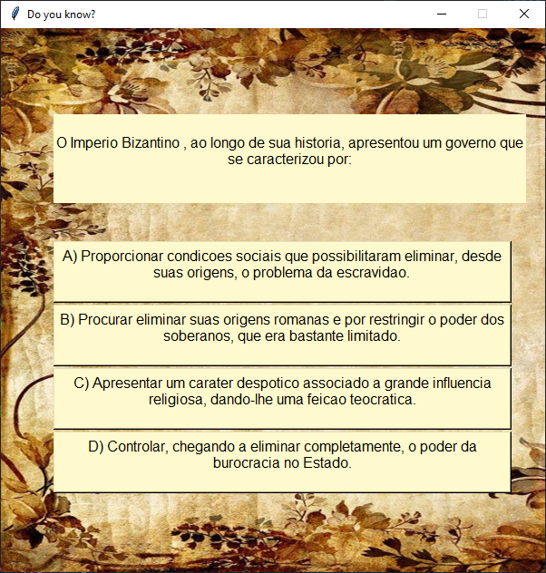

# Breve História

Requisitado como avaliação final pelo Professor Francisco Simões, o jogo 'Breve História' criado e nomeado por Maria Raquel e Welison Henrique. O Breve História é um jogo de perguntas e respostas, obviamente, sobre história geral, em três níveis, fácil, médio e difícil, cada rodada é constituida de 10 perguntas, quase que totalmente inéditas a cada jogada, para que no fim os jogadores participem de um Hanking e podem competir com a quantidade de acertos. É um jogo dinâmico, personalizado e animado com músicas divertidas que podem, até, intrigar jogadores a acertarem cada vez mais.

## Como colocar o código para rodar:

[Python](https://www.python.org/) - Tenha o Python instalado em sua máquina com autorização para acesso ao PATH.

[Pygame](https://www.pygame.org/news) - Instale o Pygame na sua máquina para rodar as músicas que trazem o divertimento ao jogo e incentiva a jogabilidade.

## Como o jogo funciona?

Em cada rodada será sorteada 10 das 24 perguntas, fazendo com que elas sejam quase que totalmente inéditas para dar um gostinho de quero mais nos jogadores. No fim, de acordo com o placar terá uma música tema como forma de incentivo para voltar a jogar e melhorar o placar.

------

